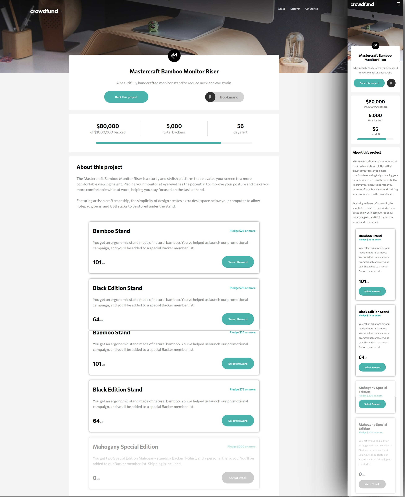

## Table of contents

- [Overview](#overview)
  - [The challenge](#the-challenge)
  - [Screenshot](#screenshot)
  - [Links](#links)
- [My process](#my-process)
  - [Built with](#built-with)
  - [Continued development](#continued-development)
- [Author](#author)

## Overview

### The challenge

Users should be able to:

- View the optimal layout for the site depending on their device's screen size
- See hover states for all interactive elements on the page

### Screenshot

### Links

- Solution URL:(https://github.com/Netosilv4/CrowdFunding-fm/)

## My process

### Built with

- React
- Styled Components
- Semantic HTML5 markup
- Mobile-first workflow
- Flexbox
- Javascript

### Continued development

- Javascript menu items and code refactoring still in progress

## Author's
- Lucas Fernandes URL:(https://www.linkedin.com/in/lucasfernandesreis/)
- Neto Silva URL:(https://www.linkedin.com/in/netosilv4/)
- Caio Shimizo URL:(https://www.linkedin.com/in/shimworks/)
- Gabriel Bueno URL:(https://www.linkedin.com/in/gbuenodev/)
